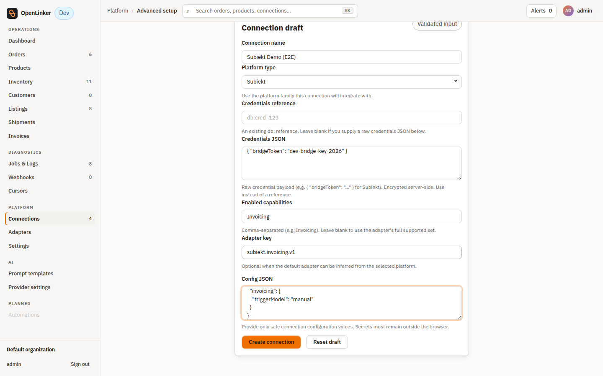
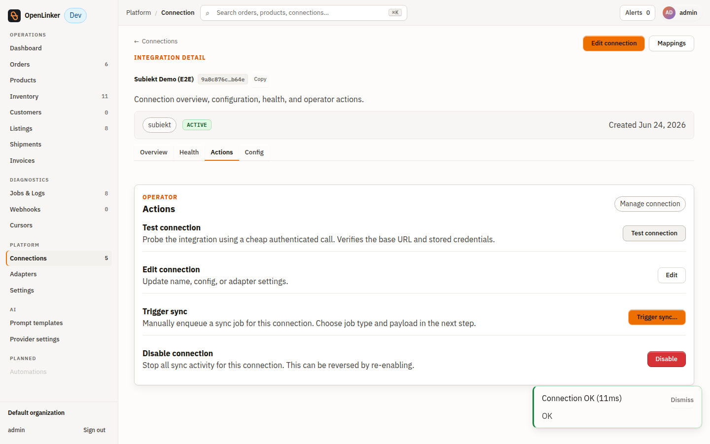
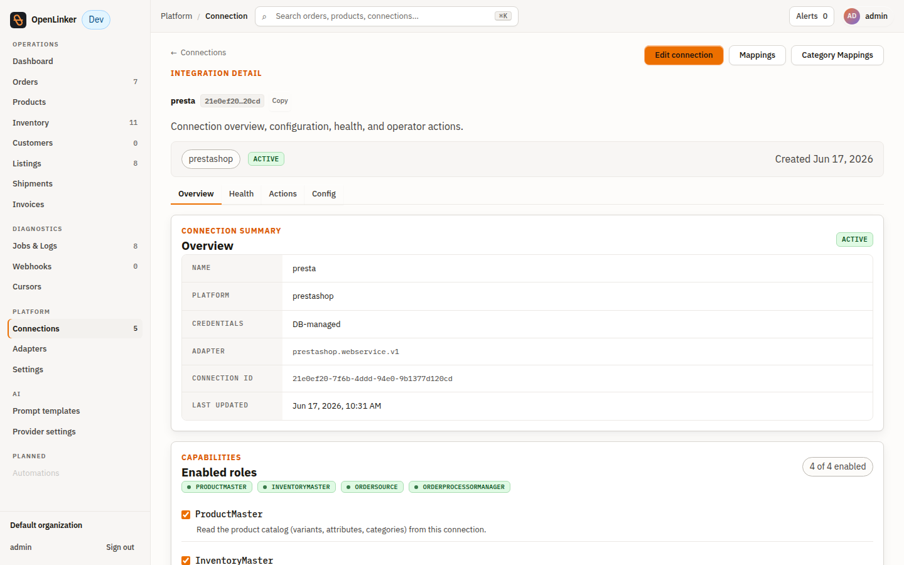
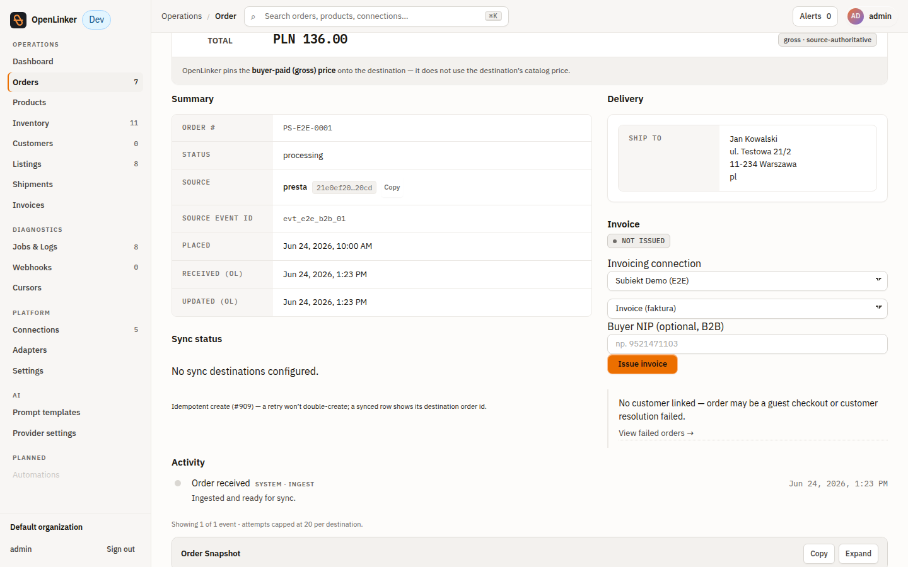
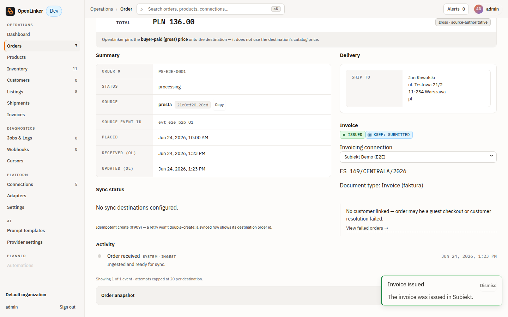
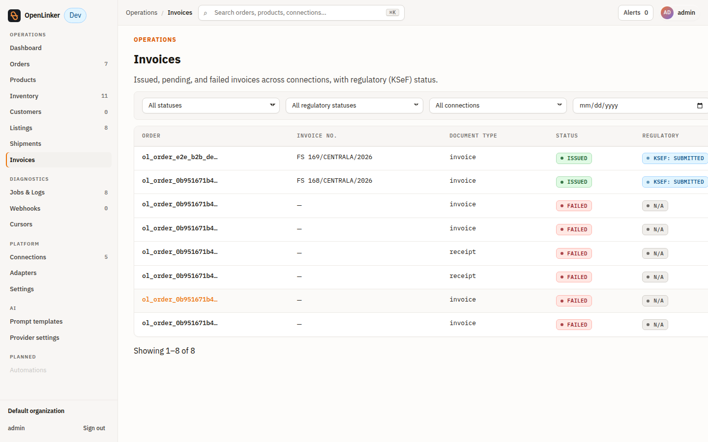

# Integracja Subiekt ↔ OpenLinker — jak dodać i przetestować (z PrestaShop)

Przewodnik krok-po-kroku: jak podłączyć Subiekt nexo do OpenLinkera przez most fiskalny i przetestować pełny przepływ **zamówienie z PrestaShop → OpenLinker → faktura/paragon w Subiekcie**.

> 📸 **Uwaga o screenach:** zrzuty poniżej pochodzą z **realnego przejścia E2E przez UI OpenLinkera** (2026-06-24): stack OL (api+worker+web), żywy most `https://172.26.96.1:5005` (Bearer, demo Nexo). Wystawiono realne dokumenty **FS 168/CENTRALA/2026** (B2C) i **FS 169/CENTRALA/2026** (B2B, NIP 9521471103) — ten drugi w całości z poziomu UI. Dwa placeholdery pozostają nieuzupełnione (most-konsola Windows i widok w samym Subiekcie) — patrz adnotacje przy nich. Dowody API-level (sekcja G) są realne.

---

## A. Architektura (co z czym gada)

```
PrestaShop  ──(zamówienia)──►  OpenLinker  ──HTTPS + Bearer──►  Subiekt Bridge (Windows)  ──Sfera──►  Subiekt nexo
   (sklep)                      (chmura/serwer)                  (przy Subiekcie)                        (Twoja baza)
```

- **PrestaShop** — źródło zamówień (connection w OL).
- **OpenLinker** — orkiestruje; ma *connection* typu **Subiekt** wskazujący na most.
- **Most (Subiekt Bridge)** — działa na Windows obok Subiekta; wystawia HTTPS API; tłumaczy na Sferę.
- **Subiekt nexo** — wystawia realny dokument (FV/PA), numerację, KSeF.

**Wymagania:** Subiekt nexo PRO + Sfera (Windows), .NET 8 runtime, OpenLinker z wtyczką Subiekt, sieć: OL musi dosięgać mostu po **HTTPS**.

---

## B. Uruchom most (Windows)

Szczegóły w `docs/DEPLOYMENT.md` §1a. Skrót:

1. Zbuduj/rozpakuj most, ustaw `appsettings` (ścieżki Sfery, SQL, operator Nexo).
2. **HTTPS (wymagane dla dostępu sieciowego):** podaj cert przez `Tls:CertPath` + `Tls__CertPassword` (env/user-secrets). Dev: self-signed (`dotnet dev-certs https -ep dev-cert.pfx -p <hasło>`). Prod: realny cert CA **albo** reverse-proxy terminujący TLS (most na loopbacku za proxy).
3. **Auth:** klucz przez `Auth__ApiKey` (env). OL wysyła go jako `Authorization: Bearer <token>`. `/health` jest anonimowy.
4. **Firewall:** otwórz port (np. 5005) inbound (reguła `New-NetFirewallRule`, zakres Domain/Private).
5. Start na adresie sieciowym: `ASPNETCORE_URLS=https://0.0.0.0:5005`. Log powinien pokazać `Now listening on: https://…` oraz `Sfera: zalogowano`.

Smoke (z maszyny gdzie działa OL):
```bash
curl -k https://<host-mostu>:5005/health
# → {"status":"ok","bridge":"up","sferaSession":"valid","subiekt":"reachable"}
```
> 📸 _[SCREENSHOT do uzupełnienia: konsola/log mostu na Windows z „Now listening on https” + „Sfera: zalogowano” — most działa (health = 200, connection-test = OK), ale uruchomiony jest jako proces Windows poza zasięgiem narzędzia do zrzutów z WSL.]_

---

## C. Dodaj connection Subiekt w OpenLinkerze

W OL → **Connections → Add connection**:
1. **Platform type:** Subiekt.
2. **Bridge URL:** `https://<host-mostu>:5005` — **bez** `/api` (ścieżki dokłada adapter).
3. **Bridge token (Bearer):** ten sam co `Auth__ApiKey` mostu (zapisywany jako *encrypted credential*, nie w plain config).
4. **Capability toggles:** włącz **Invoicing** (oraz ewentualnie „Show KSeF status” gdy dostępne).
5. **Trigger model:** `Manual` / `Auto on order paid` / `Auto on order shipped` (zacznij od `Manual`).
6. **Connection-test** → bije w `/health` mostu; powinno pokazać sukces.

> **Uwaga (stan na 2026-06-24):** Subiekt nie ma jeszcze *guided wizard* na liście „Add a connection" (brak `setupCard` we wtyczce). Połączenie dodaje się przez **Connections → Add connection → „Use advanced mode"**: `Platform type = Subiekt`, `Credentials JSON = { "bridgeToken": "<token>" }`, `Enabled capabilities = Invoicing`, `Adapter key = subiekt.invoicing.v1`, `Config JSON = { "bridgeBaseUrl": "https://<host>:5005", "invoicing": { "triggerModel": "manual" } }`. (Pola *Credentials JSON* i *Enabled capabilities* dodano w ramach tego testu — wcześniej formularz nie pozwalał wpisać tokenu od zera.)
>
> 
>
> 

---

## D. Dodaj connection PrestaShop (źródło zamówień)

W OL → **Connections → Add connection → PrestaShop**: podaj URL sklepu + webservice API key (wg istniejącej instrukcji PrestaShop). Po połączeniu OL zaciąga zamówienia.

> 
>
> **Uwaga (stan na 2026-06-24):** connection PrestaShop istnieje i jest aktywny, ale w środowisku testowym **nie ma osiągalnej instancji PrestaShop** (sync produktów/zamówień kończy się `Network error: fetch failed`). Aby przetestować przepływ faktury bez żywego sklepu, zamówienie B2B (`ol_order_e2e_b2b_demo01`, źródło = ten connection presta) **zaseedowano jako gotowy snapshot** `order_records (recordStatus='ready')` — z adresem firmowym i pozycjami gross. To jedyny obejściowy element; reszta przepływu (UI → API → most → Subiekt) jest realna.

Złóż (lub zaimportuj) testowe zamówienie w PrestaShop — pojawi się w OL na liście zamówień. Dla **faktury (B2B)** kupujący musi mieć **poprawny NIP** (z sumą kontrolną); bez NIP → **paragon (B2C)**.

---

## E. Wystaw fakturę

**Ręcznie (panel na zamówieniu — issue #757):** otwórz zamówienie → panel **Invoice** → **Issue invoice**. Status: `not issued → pending → issued`. Po sukcesie: numer dokumentu, typ (faktura/paragon), link do PDF, badge KSeF.

> **Uwaga (stan na 2026-06-24):** gdy aktywnych jest >1 connection z Invoicing, panel pokazuje *picker* połączenia (wybierz właściwy Subiekt). Pole **„Buyer NIP (optional, B2B)"** dodano w ramach tego testu — wpisanie poprawnego NIP wystawia fakturę B2B (`scheme: pl-nip`), puste → dokument B2C.
>
> 
>
> 

**Automatycznie (trigger — issue #1120):** ustaw trigger `Auto on order paid` na connectionie Subiekt → opłacone zamówienie automatycznie kolejkuje wystawienie (idempotentnie — `invoice:{connectionId}:{orderId}`, brak duplikatów przy ponownych zdarzeniach).

---

## F. Zweryfikuj

1. **W OpenLinkerze:** strona **/invoices** (issue #758) — lista z filtrami (status, data, connection, KSeF). Twój dokument na liście; PDF link działa.
   > 
2. **W Subiekcie:** otwórz Subiekt nexo → dokumenty sprzedaży → znajdź numer (np. `FS …/CENTRALA/2026`). Pozycje/VAT zgodne. Zweryfikowano przez most (`GET /api/invoices/100360/status`): `FS 169/CENTRALA/2026`, `zatwierdzony`, netto 110.58 + VAT 25.43 = brutto 136.01 PLN (VAT 23% policzony poprawnie).
   > 📸 _[SCREENSHOT do uzupełnienia: dokument otwarty w samym Subiekcie nexo (UI Windows) — poza zasięgiem narzędzia do zrzutów z WSL; potwierdzenie zamiast tego przez most, j.w.]_
3. **Idempotencja:** ponowne „Issue/Retry” z tym samym kluczem → ten sam dokument, **bez duplikatu**.
4. **KSeF:** badge statusu (`pending → accepted`); odświeżany asynchronicznie (job reconcile #1121).

---

## G. Dowód działania na wire (z testu na żywym moście + demo Nexo)

Most pod `https://…:5005`, Bearer, realny Subiekt — dokładne requesty, które wysyła adapter OL:

**Upsert kontrahenta** `POST /api/customers/upsert`:
```json
{ "nazwaSkrocona":"Wire Test Sp z o.o.", "nip":"9521471103", "typ":"firma",
  "address":{ "ulica":"Testowa 1","kodPocztowy":"00-001","miejscowosc":"Warszawa","countryCode":"PL" } }
```
→ `200 { "success":true, "data":{ "id":101169, "numer":"73" } }`

**Wystaw fakturę (FV / B2B)** `POST /api/invoices`:
```json
{ "documentType":"FV", "currency":"PLN", "orderId":"…", "idempotencyKey":"…",
  "buyer":{ "name":"Wire Test Sp z o.o.","nip":"9521471103","isCompany":true },
  "lines":[ { "name":"Usluga testowa","ilosc":1,"cenaBrutto":123.00,"stawkaVAT":"23" } ] }
```
→ `200 { "success":true, "data":{ "providerInvoiceId":100357, "providerInvoiceNumber":"FS 167/CENTRALA/2026", "state":"issued", "regulatoryStatus":"pending" } }`

**Paragon (PA / B2C)** — `documentType:"PA"`, `buyer` bez NIP → `200 … "PA 8/CENTRALA/2026", state:"issued"`.
**Idempotencja:** ten sam `idempotencyKey` → ten sam `providerInvoiceId`, `idempotent:true`.

> To są realne dokumenty wystawione w demo Nexo podczas testu integracji — potwierdzają, że łańcuch OL→most→Subiekt działa.

---

## H. Troubleshooting

| Objaw | Przyczyna / fix |
|---|---|
| `Refusing to start: non-localhost requires https` | most na adresie sieciowym bez TLS → ustaw `Tls:CertPath` (sekcja B) lub reverse-proxy + loopback. |
| Connection-test / `/api/*` → **401** | zły/brak Bearer → token w OL musi == `Auth__ApiKey` mostu. |
| OL nie dosięga mostu (timeout) | firewall inbound na porcie mostu; zły `bridgeBaseUrl` (musi być `https://…`, bez `/api`). |
| `validation: Invalid NIP checksum` | NIP kupującego z błędną sumą kontrolną → popraw NIP (B2B) lub wystaw jako paragon (bez NIP). |
| `DocumentType musi być 'FV' lub 'PA'` | nieaktualny adapter — upewnij się, że adapter mapuje neutralny typ na `FV`/`PA`. |
| Cert self-signed odrzucany przez OL | dev: zaufaj certowi / wyłącz weryfikację w dev; prod: realny cert CA. |

---

## I. Matryca wsparcia (v1)

| Subiekt | Status |
|---|---|
| **nexo PRO** | ✅ pełne wsparcie (Sfera w pakiecie) |
| **nexo (vanilla)** | ⚠️ best-effort — zależy od dostępności Sfery w licencji |
| **GT** | ❌ niewspierane w v1 (plan: osobny most v2) |

---

*Ten przewodnik powstał przy testach integracji; screeny UI do uzupełnienia przy żywym przejściu po stronie OpenLinkera. Może też zasilić oficjalną stronę dokumentacji integracji (issue #760).*
